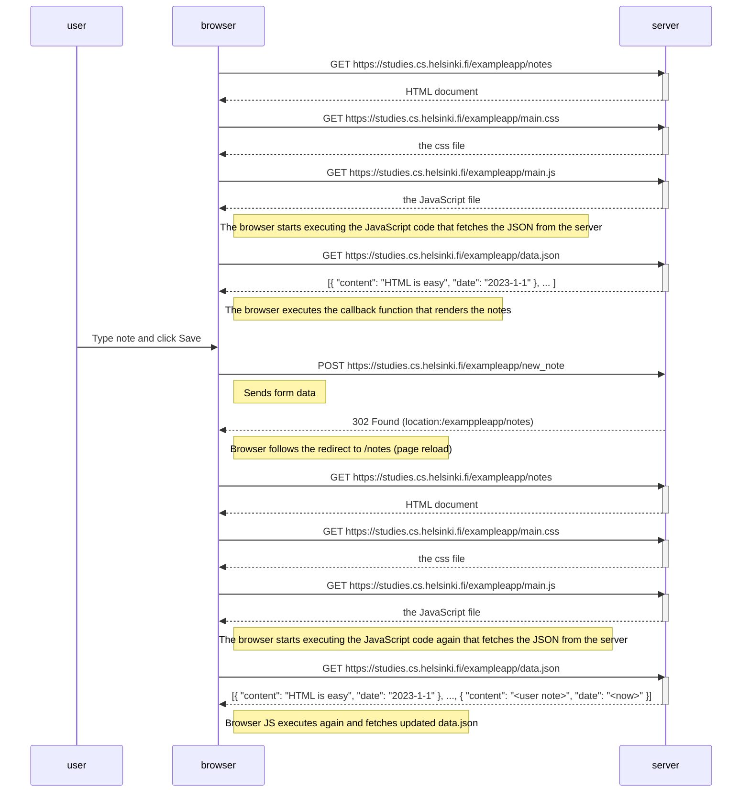
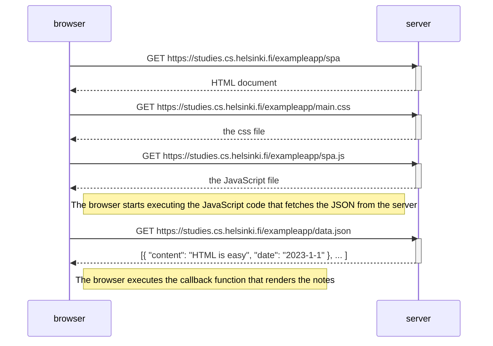

# part0OpenCode
Code Exercises For Open Full Stack Program

Each exercise is save into a different folder, please open it and you'll see the diagram corresponding to that specific exercise

Exercises 1-3 are not submitted since they are obly tutorials

preview of documents without explanations here:

EXERCISE 4:



EXERCISE 5:



EXERCISE 6:

```mermaid
```

